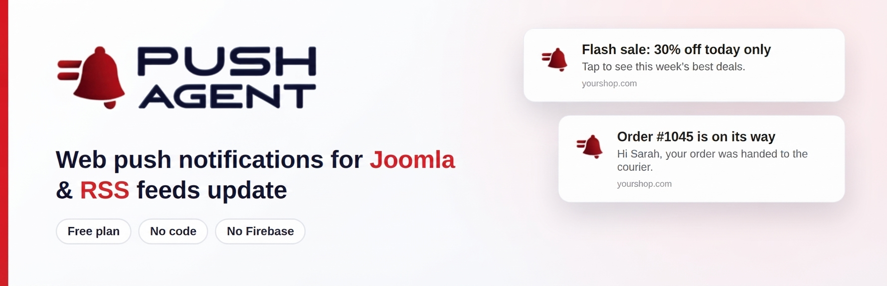

<p align="center">
  
</p>

# Push Agent for Joomla

**Free web push notifications for your Joomla site.** A small system plugin that adds the Push Agent script to every page and creates the service worker for you.
Standard Web Push: no Firebase project and no Google account needed.

[Website](https://pushagent.net) · [Install on Joomla (guide)](https://pushagent.net/docs/how-to-install-push-agent-in-joomla/) · [Pricing](https://pushagent.net/pricing/)

---

## Features

- Adds the Push Agent script to every front-end page — no template editing.
- Creates the `pushagent-sw.js` service worker in your site's root folder automatically.
- Choose how many seconds to wait before visitors are asked to allow notifications.
- Send to everyone or target by country, device and browser, and schedule notifications from your [Push Agent dashboard](https://app.pushagent.net).
- Works in Chrome, Edge, Firefox, Opera and Safari, on desktop and mobile.

## Requirements

- Joomla 3.8 or newer (Joomla 3, 4, 5 and 6)
- An HTTPS website (browsers only allow push on secure sites)
- A free Push Agent account at [app.pushagent.net](https://app.pushagent.net)

## Installation

1. Download the latest `plg_system_pushagent.zip` from [Releases](../../releases).
2. In Joomla, go to **System → Install → Extensions** (Joomla 3: **Extensions → Manage → Install**) and upload the zip.
3. Sign in at [app.pushagent.net](https://app.pushagent.net) (free), add your website, open **Integration** and copy your **access token**.
4. Go to **System → Manage → Plugins** (Joomla 3: **Extensions → Plugins**), open **System - Push Agent**, paste the token and click **Save**.
5. Back in your Push Agent dashboard, click **Verify integration**.

The full guide with screenshots is at **[pushagent.net/docs/how-to-install-push-agent-in-joomla](https://pushagent.net/docs/how-to-install-push-agent-in-joomla/)**.

### Plugin settings

| Setting | What it does |
|---|---|
| Access token | Connects the plugin to your website in Push Agent. |
| Delay | Seconds to wait before the "Allow notifications" card appears (default 3). |
| Create pushagent-sw.js automatically | Switch off only if you upload the service worker file yourself. |

## Building the install package

The install zip contains the files in this repository's root:

```
pushagent.php
pushagent.xml
script.php
language/en-GB/en-GB.plg_system_pushagent.ini
language/en-GB/en-GB.plg_system_pushagent.sys.ini
```

## External service

This plugin loads a script from the Push Agent service at [app.pushagent.net](https://app.pushagent.net), run by the makers of this plugin, which stores subscriptions and delivers notifications. Nothing is stored for visitors who don't subscribe. See our [privacy policy](https://pushagent.net/privacy-policy/).

## Support

- Documentation: [pushagent.net/docs](https://pushagent.net/docs/)
- Questions and help: [pushagent.net/support](https://pushagent.net/support/)
- Bugs: [open an issue](../../issues)

## Licence

GPL-2.0-or-later. See [LICENSE](LICENSE).
